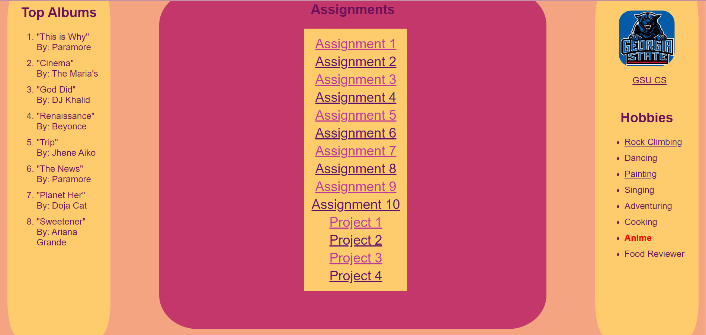
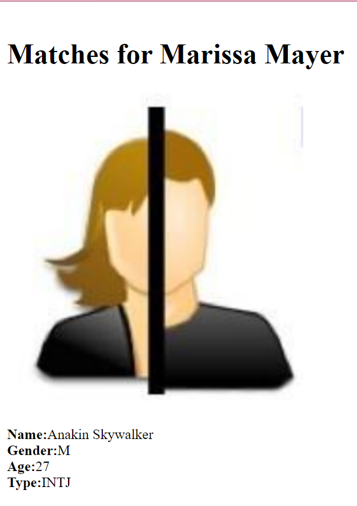

# Front-End_Fundementals - Web Programming Class Assignments - Development Basics

Welcome to my web programming class assignments!

In this course, we focused on front-end development, covering HTML/CSS, PHP, JavaScript, and MariaDB SQL. Each project aimed to teach different aspects of web development. Below, you'll find a summary of each assignment along with links to their respective project files.
 
## Personal Webpage
Link: [Personal Webpage](./index.html)

Description: The Personal Webpage project was designed to explore the various uses of HTML and CSS. It provided hands-on experience with classes, IDs, buttons, span tags, anchor tags (`<a>` tags), and containers. Through this project, I gained a better understanding of structuring and styling web content. The `index.html` file serves as the central hub connecting all the projects. It provides links to each assignment, allowing easy navigation and exploration of the different concepts and techniques learned throughout the course.

Feel free to explore the projects and delve into the code to understand the principles of front-end development that I learned in this web programming class.

## TMNT Movie
Link: [TMNT Movie](../2/tmnt.html)

Description: The TMNT Movie project simulated a mock review page similar to Rotten Tomatoes, focusing on understanding display properties like float and position in web development. By creating a webpage for the Teenage Mutant Ninja Turtles movie, I learned how to manipulate element placement and alignment effectively.

## NerdLuv
Link: [NerdLuv](../3/index.php)

Description: NerdLuv was a dating site project that involved user sign-up and matchmaking based on opposite gender, age range, and other criteria. PHP post forms were used to create accounts, and data was pulled from a text file "singles.txt" to find potential matches. This project provided insights into user authentication, form handling, and data manipulation.

## 15 Puzzle Game
Link: [15 Puzzle Game](/Projects/2_5/index.html)

Description: The 15 Puzzle Game project challenged me to create a sliding puzzle game with varying levels (3x3, 5x5, and 10x10). JavaScript and animation were employed to enable users to move the blank square and solve the puzzle. Adjacent squares that could be swapped were highlighted in red, enhancing the user experience.

## BrewTrade Dashboard
Link: [BrewTrade Dashboard](/Projects/3/index.html)

Description: The BrewTrade Dashboard project utilized MariaDB to store information for buyers, sellers, and admins of a fictional coffee-selling company. This involved creating user sign-up, login, and dashboard pages. I designed the admin dashboard, focusing on PHP and MariaDB integration to manage user flows and corresponding pages.

